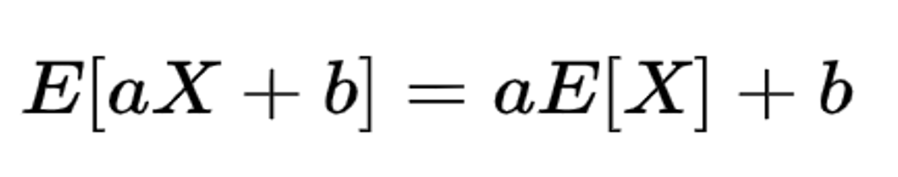
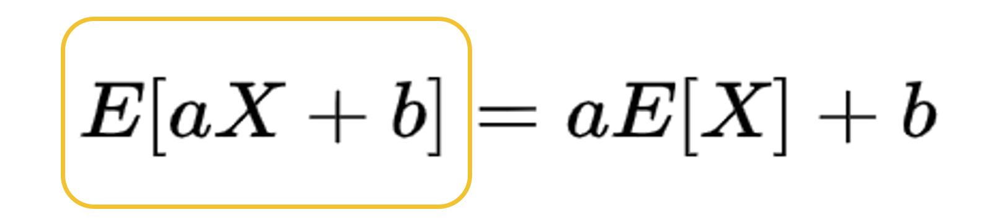
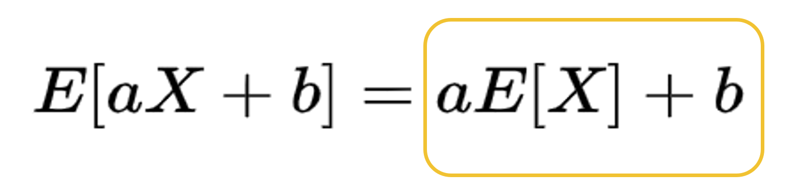

# I "EXPECT" a Visual Demo! - Visualizing the Linearity of Expectation

In the fall of 2023, I took CS 109 and we got to the topic of expectation. Since I really like learning mathematics in a visual way, I tried to Google for visual guides or videos about expectation. To my disappointment, most explanations ended up being numerical and unintuitive. So I took matters in my own hands and made this.

Expectation can be a confusing, unintuitive concept. What is an expected value? How do we try and find ways to visualize expectation? Why does this matter in the long run of our probability-related journey? This project seeks to use visuals, examples, and intuition to give a primer on expectation before the nitty-gritty mathematical background of this concept is presented.

# DEFINITION OF EXPECTATION
Let's first visualize the definition of expectation (aka: Mean, Weighted Average, Center of Mass, 1st Moment). Let's take a simple example of a button that returns one of three numbers. The three possible values are 0, 5, and 10. What value should we expect in return? In earlier understandings of probability, we start off with an understanding of means without an weighted element. The sum of the nums is 0 + 5 + 10 = 15. There are three numbers in total. So, it appears our average value would be 15/3 = 5. (Or coins?)

Here is where we add to the story. What if each number had a different probability of returning? In many cases of probability, not all values have the same probability. This is especially true once we move past coin flips and dice rolls into examples modelled by random variable distributions. Below, you can see an example where you can use a slider to change the likelihoods of each value. As a result, our expectation will look different.
 [INSERT: SLIDER EXAMPLE AND BUTTON]

# LINEARITY OF EXPECTATION

One property of expectation is that [INSERT EQUATION], given that a and b are constants. How can we visualize this? Let's use the classic example of a six-sided die. The expected return value of a six-sided die where each result is of equal probability is 3.5, but that itself does not help us give us much information about constants. 

# OUR STORY

# THE FIRST HALF

<iframe src="https://rooyi.github.io/salarydemo/salarydemo.html" width="500px" height="450px"></iframe>

# THE SECOND HALF

And the second half of the equation:
<iframe src="https://rooyi.github.io/salarycount/salarycount.html" width="500px" height="350px"></iframe>

# WHAT DOES THIS MEAN?

# FURTHER EXPLORATION
The example illustrated by this interactive tool is based off of the [MIT RES.6-012 Introduction to Probability](https://www.youtube.com/watch?v=0IJFBMIU6x4), Spring 2018 lecture on Linearity of Expectations as delivered by John Tsitsiklis.

If you enjoy seeing probability be visually depicted, the [Seeing Theory project](https://seeing-theory.brown.edu/) from a team at Brown University offers a wide range of probability concepts.

**Credits:**
Inspired by the open-source code from the Seeing Theory project from Brown University.
ChatGPT-3.5 has been used to help with some parts of code debugging/implementation.
